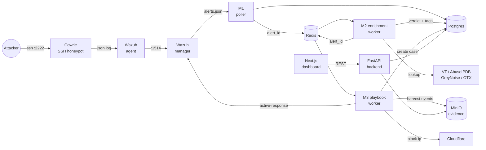

# SentinelForge

[](https://github.com/fab561/sentinelforge/actions/workflows/ci.yml)


**Open-source SOC Automation Platform (SOAR).** Replaces ~$100k/yr commercial
tooling (Splunk SOAR, Cortex XSOAR) with free + open-source components for
small SOCs, MSSPs, university labs, and CTF teams.

Detects an attack with Wazuh, enriches it against four threat-intel feeds,
runs a YAML-defined playbook to block + open a case, harvests evidence
from a Cowrie honeypot, and surfaces it all in a Next.js dashboard — in
under 15 seconds, fully automated.

---

## What you get

| Capability | Page | Status |
|---|---|---|
| Live alert ingestion (Wazuh poller) | `/alerts` | Working |
| Real threat-intel enrichment (VT + AbuseIPDB + GreyNoise + OTX) | `/alerts/[id]` | Working |
| Auto-verdict + threat scoring | dashboard cards | Working |
| YAML-defined playbook engine + dry-run | `/playbooks` | Working |
| Cloudflare edge IP blocking | playbook action | Working |
| Wazuh active-response (host firewall, account disable, isolate) | playbook action | Working |
| Auto-correlation — duplicate alerts collapse into one case | `/cases/[id]` | Working |
| MITRE ATT&CK coverage heatmap | `/mitre` | Working |
| Case lifecycle + MTTA/MTTR SLA charts | `/dashboard` | Working |
| Analyst-curated IOC watchlist (re-uses past intel) | `/iocs` | Working |
| Evidence attachments (PCAPs, Cowrie sessions) — MinIO + sha256 dedup | `/cases/[id]` | Working |
| Cowrie session-log auto-attach to honeypot cases | playbook hook | Working |
| Audit log of every case + evidence mutation | `/audit` | Working |
| PDF case export (forensic-style report) | case detail | Working |
| Per-IP API rate limiting | backend | Working |
| Light / dark / system theme | sidebar | Working |
| 30 Wazuh rules across 10 MITRE tactics | `/rules` | Working |
| pytest + GitHub Actions CI | `tests/`, `.github/` | Working |

---

## Architecture



End-to-end flow from "attacker hits the trap" to "analyst sees the
auto-resolved case with attached evidence" runs in roughly 15 seconds.

---

## Modules

| # | Module | Owner | Description |
|---|---|---|---|
| M1 | SIEM Core & Data Pipeline | Farhad (lead) | Wazuh poller, FastAPI, Postgres, Redis, alert correlation, audit log, PDF export, rate limiting |
| M2 | Threat Intel & Enrichment | Kunal | 4 free TI providers, weighted scoring, IOC watchlist |
| M3 | Playbook Engine & Response | Tathagata | YAML engine, dry-run, 6 action types (notify, block_ip, wazuh_active_response, create_case, tag_alert, update_status) |
| M4 | Frontend Dashboard | Chandrakant | Next.js 16, shadcn/ui, dark/light theme, 10 pages, MITRE heatmap, MTTR charts |
| M5 | Honeypot | Ayush | Cowrie SSH honeypot, Wazuh agent, session-log auto-attach to cases |

---

## Quick start

Requires Docker Desktop or a Linux Docker engine + Docker Compose v2.

```bash
git clone https://github.com/fab561/sentinelforge.git
cd sentinelforge

# Copy and edit env (default passwords work out of the box for local lab)
cp .env.example .env

# Bring the stack up (10 containers — first boot pulls ~3GB)
docker compose up -d

# Backend auto-creates tables + seeds 20 alerts / 3 cases / 30 rules
# on first boot — no extra step needed.

# Optional: re-sync the rules catalog after editing seed.py
docker exec sf-backend python seed_rules.py
```

Then in a separate terminal start the frontend dev server:

```bash
cd frontend
npm install
npm run dev
```

Endpoints:

| Service | URL | Notes |
|---|---|---|
| Dashboard | http://localhost:3000 | Next.js — main UI |
| Backend API | http://localhost:8000 | FastAPI |
| API docs (Swagger) | http://localhost:8000/docs | auto-generated |
| Wazuh dashboard | http://localhost:5601 | OpenSearch-based |
| MinIO console | http://localhost:9101 | evidence storage UI |
| Cowrie SSH (honeypot) | `ssh -p 2222 root@localhost` | password: anything (some pwds work, most fail — log captures everything) |

---

## Free threat-intel API keys

All four providers offer free tiers ample for development:

| Provider | Free tier | Sign-up |
|---|---|---|
| VirusTotal | 500 lookups/day | https://www.virustotal.com/gui/join-us |
| AbuseIPDB | 1,000 checks/day | https://www.abuseipdb.com/register |
| GreyNoise (Community) | 50 lookups/day | https://viz.greynoise.io/signup |
| AlienVault OTX | unlimited (~10 req/s) | https://otx.alienvault.com/signup |

Drop them into `.env`:

```
VIRUSTOTAL_API_KEY=...
ABUSEIPDB_API_KEY=...
GREYNOISE_API_KEY=...
OTX_API_KEY=...
```

Then `docker compose up -d --force-recreate enrichment-worker` to load.

---

## Demo flow

What happens in a 90-second demo:

1. SSH-bruteforce the honeypot from any machine: `ssh -p 2222 root@<host>`.
2. Cowrie logs the attempt, Wazuh agent ships it, M1 poller picks it up,
   alert lands in Postgres + Redis.
3. M2 worker hits VT / AbuseIPDB / OTX in parallel — verdict in ~10s.
4. If verdict is malicious or critical: M3 playbook fires — Cloudflare
   block (if configured), Wazuh active-response on the host, case opens
   automatically, status set to `escalated`.
5. M3 cowrie evidence harvester scans cowrie.json + tty replays for the
   attacker IP, uploads them to MinIO, attaches to the new case.
6. Analyst opens `/cases/<id>` — sees the alert, the threat intel tags,
   the playbook actions taken, the attached evidence ready for download.
7. Click **Export PDF** for a forensic-style report ready to attach to a
   ticket.
8. Subsequent alerts from the same IP correlate into the existing case
   instead of opening duplicates.

---

## Detection coverage

29 custom Wazuh rules covering 10 MITRE ATT&CK enterprise tactics:

| Tactic | Rule IDs | Examples |
|---|---|---|
| Reconnaissance | 100250–100251 | port scan, scanner-tool invocation |
| Initial Access | 100252–100253 | web shell upload, external SSH login |
| Execution | 100220–100221, 100202 | wget/curl + chmod, downloaded file exec, cowrie commands |
| Persistence | 100254–100257 | cron, authorized_keys, new user, systemd unit |
| Privilege Escalation | 100230–100231 | sudo failures, failed su |
| Defense Evasion | 100260–100263 | Wazuh tampered, log cleared, firewall flushed, history wiped |
| Credential Access | 100210–100211, 100270 | brute force, distributed brute force, /etc/shadow read |
| Discovery | 100250 | port scan |
| Command & Control | 100280–100281 | reverse shell, base64 obfuscation |
| Impact | 100290–100291 | cryptominer, destructive command |

Plus 4 honeypot-specific rules (100200–100203) and 2 file-integrity rules
(100240–100241). Full list in [`wazuh/custom_rules/sentinelforge_rules.xml`](wazuh/custom_rules/sentinelforge_rules.xml).

---

## Tech stack

- **SIEM:** Wazuh 4.14 (manager + indexer + dashboard) on OpenSearch 2.19
- **Honeypot:** Cowrie (emulated SSH, full session capture)
- **Backend:** FastAPI 0.115, SQLAlchemy 2 async, Alembic, Pydantic v2
- **DB:** PostgreSQL 16 with JSONB for observables / enrichment
- **Queue:** Redis 7
- **Object storage:** MinIO (S3 API), bucket per environment, sha256-keyed
- **Threat intel:** VirusTotal, AbuseIPDB, GreyNoise, AlienVault OTX
- **Playbook engine:** PyYAML + asyncio, no Celery dependency
- **Frontend:** Next.js 16 App Router, React 19, Tailwind v4, shadcn/ui, recharts, lucide-react
- **PDF:** fpdf2 (pure-Python wheel, no system deps)
- **Rate limiting:** slowapi (in-process; swap to Redis backend at scale)
- **Tests:** pytest + pytest-asyncio
- **CI:** GitHub Actions (backend pytest + frontend tsc/lint/build + compose validate)
- **Container orchestration:** Docker Compose v2

---

## Project layout

```
sentinelforge/
  .github/workflows/ci.yml       # backend / frontend / compose CI jobs
  docker-compose.yml             # 11 services, 1 network
  .env.example                   # config template
  playbooks/                     # YAML playbook definitions (4 included)
  wazuh/
    custom_rules/                # 29 SOC detection rules (XML)
    indexer/, dashboard/         # OpenSearch + dashboard config (security off)
  backend/
    Dockerfile, requirements.txt
    seed.py                      # initial data
    seed_rules.py                # idempotent rule re-sync
    alembic/                     # migrations
    tests/                       # pytest suite (21 tests)
    app/
      main.py
      core/                      # config, db, redis, storage, rate_limit, wazuh
      models/                    # SQLAlchemy: alerts, cases, evidence, iocs, rules, audit, users
      schemas/                   # Pydantic request/response
      services/                  # business logic
      api/                       # FastAPI routers
      ingestion/                 # Wazuh poller + normalizer + Redis queue
      enrichment/                # M2 worker + 4 providers + scoring + cache
      playbook/                  # M3 engine + worker + 6 actions
  frontend/                      # M4 — Next.js 16 dashboard
    app/                         # 10 pages
    components/                  # shadcn/ui + custom (EvidencePanel, ThemeToggle, ...)
    lib/                         # api client, types, mitre reference
  m5/
    cowrie/                      # honeypot config
    wazuh-agent/                 # Wazuh agent Dockerfile
```

---

## Development

```bash
# Run the backend test suite (21 tests, ~1.3s)
docker exec sf-backend pytest tests/ -v

# Backend syntax check (CI also runs this)
docker exec sf-backend python -m compileall -q app

# Frontend typecheck + lint
cd frontend && npx tsc --noEmit && npx eslint . --ext .ts,.tsx

# Validate playbook YAML and Wazuh rule XML
python - <<'PY'
import yaml, glob, xml.etree.ElementTree as ET
[yaml.safe_load(open(f)) for f in glob.glob("playbooks/*.yaml")]
ET.fromstring("<root>" + open("wazuh/custom_rules/sentinelforge_rules.xml").read() + "</root>")
print("ok")
PY
```

CI runs all of the above on every push to master and every PR.

---

## Screenshots

Drop PNGs into `docs/screenshots/` and they'll show up here:

- 
- 
- 
- 
- 
- 
- 

---

## Roadmap

- Authentication + RBAC (currently all endpoints open — lab use only)
- Prometheus `/metrics` + Grafana for SOC ops health
- Frontend tests (Playwright smoke)
- Webhook + email notifications
- Sigma rule import → Wazuh translation
- Multi-tenant isolation
- HA: clustered indexer, multi-replica backend behind nginx

---

## Team

Built as a college cybersecurity capstone — zero budget, all free /
open-source tooling. Contributors:

- **Farhad** ([@fab561](https://github.com/fab561)) — M1 lead, infra
- **Kunal** ([@kc-2001-sys](https://github.com/kc-2001-sys)) — M2 enrichment
- **Tathagata** ([@TathagataXTron](https://github.com/TathagataXTron)) — M3 playbooks
- **Chandrakant** ([@Chandra721457](https://github.com/Chandra721457)) — M4 frontend
- **Ayush** ([@14DF-3812](https://github.com/14DF-3812)) — M5 honeypot

## License

MIT
